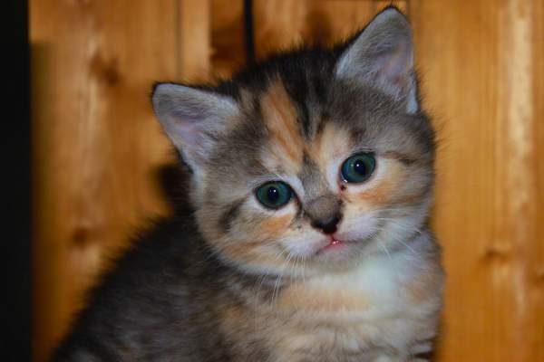

## Generated image

```{r self-contained-image, fig.cap="a ggplot2-generated graph"}
library(tibble)
library(ggplot2)

data_frame(
  x = rnorm(1000),
  y = rnorm(1000)
) %>%
 ggplot(aes(x, y)) +
 geom_point()
```

## Protocol tests

* [mailto:](mailto:questions@hi.foo.bar)


## HTTP codes

* [404](https://httpbin.org/status/404)
* [200](https://httpbin.org/status/200)


## Local links

* [valid](test_anchors.html)
* [broken](test_foo_bar_missing.html)
* [local within valid](#protocol-tests)
* [local within invalid](#foo-bar-section)
* [local outside valid link valid fragment](test_anchors.html#test-anchor)
* [local outside valid link invalid fragment](test_anchors.html#foo-bar-section)
* [local outside invalid link irrelevant fragment](test_foo_bar_missing.html#foo-bar-section)

## Images

### Broken local

Handled with test_images.html (pandoc detects broken paths).

### Broken external


### Local with alt



[Image](https://www.flickr.com/photos/olaeinang/3544175674/in/album-72157618428681984/) CC-BY 2.0 by [Ola Einang](https://www.flickr.com/photos/olaeinang/) via <https://placekitten.com>.

### Local without alt


[Image](https://www.flickr.com/photos/olaeinang/3544175674/in/album-72157618428681984/) CC-BY 2.0 by [Ola Einang](https://www.flickr.com/photos/olaeinang/) via <https://placekitten.com>.

### External with alt


[Image](https://www.flickr.com/photos/fazen/17200735/in/album-217963/) CC-BY 2.0 by [Stefano Mortellaro](https://www.flickr.com/photos/fazen/) via <https://placekitten.com>.

### External without alt


[Image](https://www.flickr.com/photos/fazen/17200735/in/album-217963/) CC-BY 2.0 by [Stefano Mortellaro](https://www.flickr.com/photos/fazen/) via <https://placekitten.com>.
